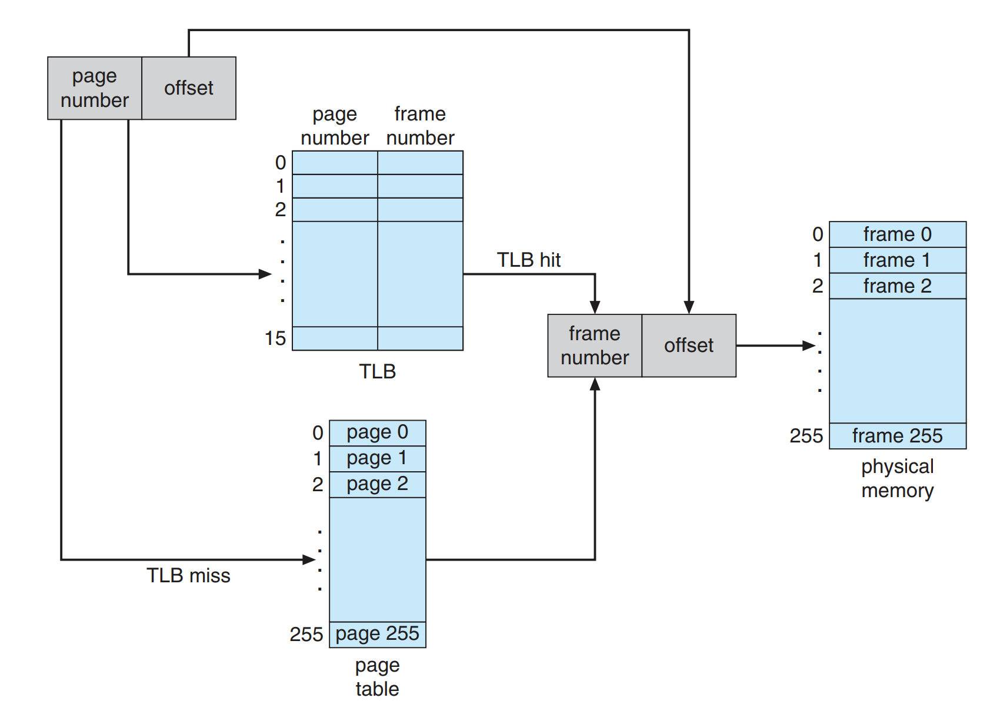

# PA3: Virtual memory manager

Mr. Kim은 시험 공부를 하던 중, demand paging이 잘 이해가 가지 않았다. 직접 프로그래밍을 해보면 확실하게 이해할 수 있다는 조언을 듣고 직접 작은 규모의 Virtual memory manager를 작성해 보기로 했다.

## 환경

- TLB slot: 16개
- Page 크기: 256B
- Page 개수: 256개
- Frame 크기: 256B
- Frame 개수: 256개
- Virtual memory 및 Physical memory 크기: 65536B
- Backing store: 65536B
- 모든 replacement는 FIFO 방식으로 한다.

## Virtual address의 구조

CREDIT:  Silberschatz et al, "Operating System Concepts", 9th

뒤의 16 bit만을 masking 한 뒤, page number와 offset을 얻어낸다.

[What is Bit Masking?](https://stackoverflow.com/questions/10493411/what-is-bit-masking)

## 흐름도

CREDIT:  Silberschatz et al, "Operating System Concepts", 9th

# 주요 함수

## to_phy_addr

- Virtual address가 들어왔을때, 위 흐름도를 통해 physical memory에서의 address로 번역

## lookup_phy_mem

- physical address 위치의 physical memory 값을 읽어서 리턴

## page_fault_handler

- 만약 page fault가 일어날 경우,
    - `BACKINGSTORE.bin` 파일에서 요청된 page number 번째의 페이지 256B만큼을 읽어 해당 번째의 physical memory의 frame에 로딩
    - Page table에 frame number 기록

# Grading

- Deadline: **2019년 6월 18일 오후 11시 59분**
- 구현 90점 + 보고서 10점
    - linear-access.txt 입력에 따른 출력이 맞는 경우 (30점)
    - random-access.txt 입력에 따른 출력이 맞는 경우 (30점)
    - Page fault rate & TLB hit rate이 모두 맞는 경우 (30점)
